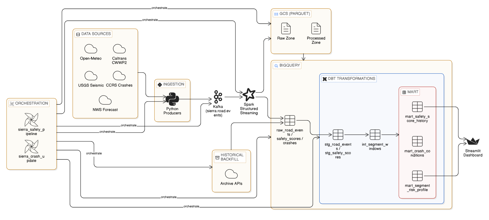
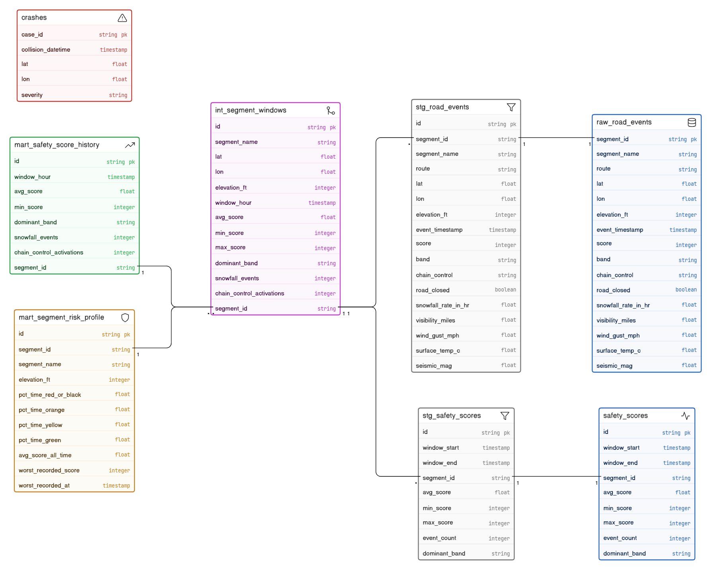
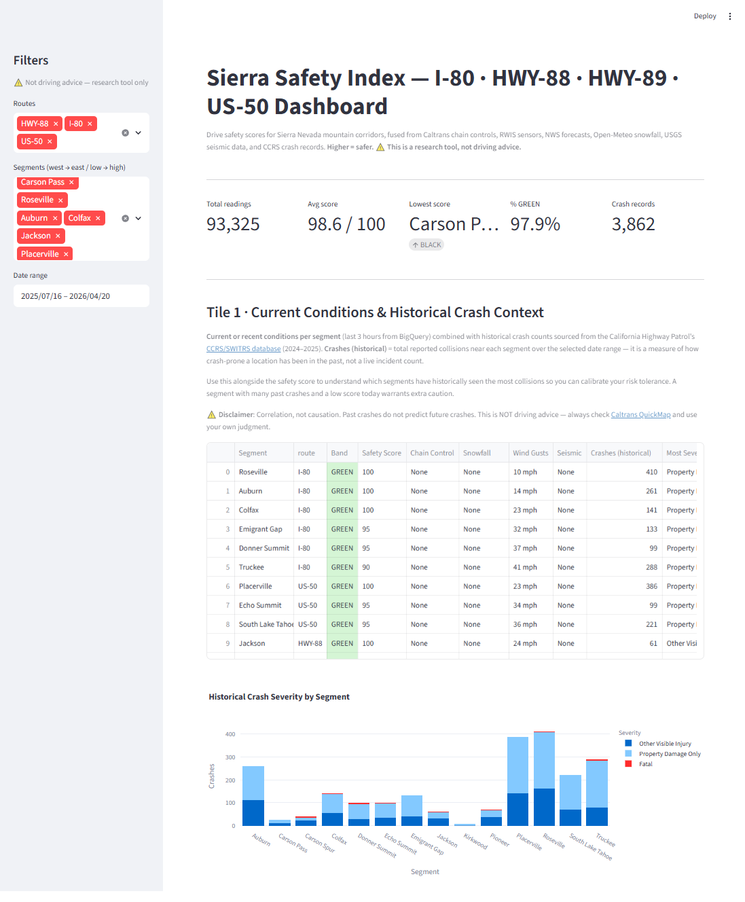
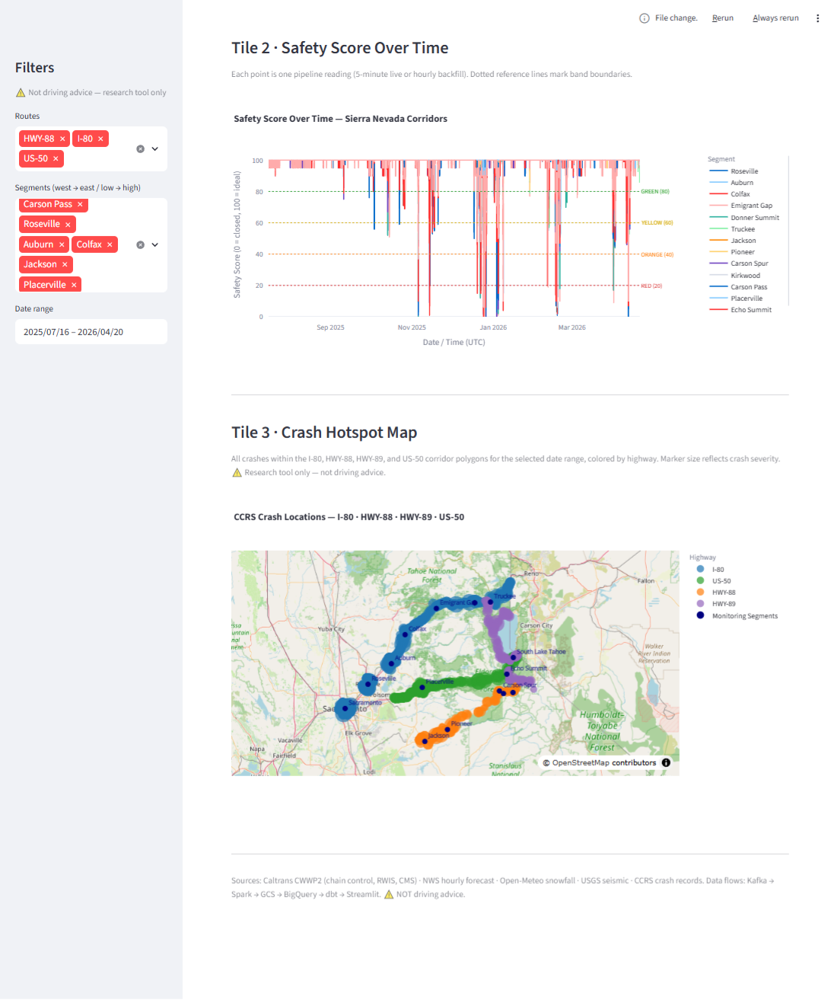

# Sierra Safety Index

> ⚠️ **Disclaimer**: This is a research and educational tool. It is NOT driving advice. Always check Caltrans QuickMap and use your own judgment before driving in mountain conditions.


---

## Problem Description

### The Problem

Every winter, tens of thousands of drivers cross the Sierra Nevada mountain corridors (I-80, US-50, HWY-88) through rapidly changing and potentially life-threatening road conditions. Snow storms, ice, high winds, chain control requirements, and seismic activity can transform a safe highway into an extreme hazard within minutes.

**This free public tool answers the question: "How dangerous is this road right now, and what does history say about conditions like these?"**

Individual data sources exist in silos:

- Caltrans publishes chain control status — but not combined with weather
- RWIS road-weather sensors report visibility and surface temperature — but not combined with crash history
- NWS forecasts snowfall — but not cross-referenced with past accident rates
- CCRS tracks crash records — but not linked to the concurrent road conditions

Drivers are left to manually check 4–5 separate websites and mentally synthesize the risk themselves. For inexperienced drivers — or anyone unfamiliar with mountain driving — this is error-prone and often skipped entirely.

### The Solution

The **Sierra Safety Index** is a real-time streaming data pipeline that fuses six free public data sources every five minutes to compute a per-segment **Drive Safety Score** (0–100) for 15 waypoints across three Sierra Nevada corridors.

**What it does:**

- Ingests Caltrans chain control status, RWIS road-weather sensor readings, NWS hourly forecasts, Open-Meteo snowfall/wind data, USGS seismic events, and CCRS crash records every 5 minutes via Kafka
- Applies a calibrated weighted penalty formula to produce a single 0–100 safety score per segment
- Streams data through Spark Structured Streaming → GCS → BigQuery, building a queryable historical time-series
- Transforms raw data through a dbt pipeline into dashboard-ready mart tables
- Surfaces results in a three-tile Streamlit dashboard showing current conditions with historical crash context, safety score trends over time, and a crash hotspot map

**What it enables:**

> _"What was the actual danger level at Donner Summit at 7 am on a February Saturday, and how predictable was it six hours earlier? How many crashes occurred under similar conditions?"_

This historical record — fusing conditions + outcomes — is the foundation for eventually predicting crash likelihood under current conditions.

---

## Architecture



The end-to-end data flow is:

```
Public APIs → Kafka (producer) → Spark Structured Streaming (consumer) → GCS → BigQuery → dbt → Streamlit
```

---

## Cloud & IaC (Terraform)

Infrastructure runs on **Google Cloud Platform (us-central1)**. BigQuery datasets and tables, GCS buckets (raw + processed zones), and IAM bindings are declared in `terraform/main.tf` and provisioned with `terraform apply`, so the environment can be recreated from code rather than set up by hand in the console.

**Resources provisioned by Terraform:**

- GCS bucket: `sierra-safety-raw-{project_id}` (raw Kafka payloads)
- GCS bucket: `sierra-safety-processed-{project_id}` (Spark output, Parquet)
- BigQuery dataset: `sierra_safety`
- BigQuery tables: `raw_road_events` (partitioned + clustered), `safety_scores`, `crashes` (partitioned + clustered)
- IAM: service account bindings for BigQuery and GCS read/write

---

## Streaming Pipeline

The streaming path uses a **Kafka producer → Spark Structured Streaming consumer** architecture.

### Producer (`ingestion/producer.py`)

- Runs on a 5-minute poll loop
- Calls all 6 data sources in parallel (Caltrans CWWP2, NWS, Open-Meteo, USGS, CCRS)
- Applies the safety score formula to produce a scored event per segment
- Publishes each event as an Avro-serialized message to the `sierra.road.events` Kafka topic
- Kafka broker + Zookeeper + Schema Registry run locally via Docker Compose

### Consumer (`streaming/spark_consumer.py`)

- Spark Structured Streaming job reads from the `sierra.road.events` Kafka topic
- Computes **15-minute tumbling window aggregates** (avg/min/max score, dominant band, event count) per segment using Spark's native windowing — available on the streaming DataFrame for in-stream monitoring and debug sinks
- Writes each micro-batch of raw events to GCS as Parquet (partitioned by date) using Spark's `foreachBatch`
- Loads those Parquet files from GCS into the `raw_road_events` BigQuery table via a BigQuery load job — chosen over a streaming-insert connector so we stay off the streaming-insert quota and keep precise control over the table's schema, DAY partitioning, and clustering
- dbt picks up `raw_road_events` on its next scheduled run and rebuilds the hourly window aggregates in `int_segment_windows`

In total, this includes a live Kafka broker, a Python producer publishing scored events, and Spark Structured Streaming consuming and aggregating them before writing to the data warehouse.

---

## Data Model (ERD)



The pipeline follows a **medallion architecture** (Bronze → Silver → Gold), with each layer progressively refining raw data into dashboard-ready metrics.

| Layer      | Contents                                                                                                                                                                                                                     | Materialisation                           |
| ---------- | ---------------------------------------------------------------------------------------------------------------------------------------------------------------------------------------------------------------------------- | ----------------------------------------- |
| **Bronze** | `raw_road_events`, `safety_scores`, `crashes` — raw BigQuery tables written directly by Spark and the backfill/CCRS scripts. No transformations; append-only.                                                                | BigQuery tables (partitioned + clustered) |
| **Silver** | `stg_road_events`, `stg_safety_scores` — dbt staging views that enforce correct types and a stable schema contract. `int_segment_windows` joins and hourly-aggregates both staging sources into a single clean intermediate. | dbt views / intermediate                  |
| **Gold**   | `mart_safety_score_history`, `mart_segment_risk_profile`, `mart_crash_conditions` — dbt mart tables consumed by the Streamlit dashboard.                                                                                     | dbt incremental / full-refresh tables     |

The pipeline writes to three raw BigQuery tables and transforms them through four dbt layers before the dashboard reads anything. Dashboard queries go through dbt mart models.

### BigQuery Source Tables

- **`raw_road_events`** — one row per segment per 5-minute poll cycle. The primary fact table: stores every sensor reading (snowfall rate, visibility, wind gusts, surface temp, seismic magnitude, chain control status) alongside the computed safety score for that moment. Written by Spark (live streaming) and `ingestion/backfill.py` (historical seed).
- **`safety_scores`** — optional 15-minute tumbling window aggregates (avg/min/max score, dominant band, event count per segment). When present, dbt reads it directly; when absent, `int_segment_windows` recomputes the equivalent aggregates from `raw_road_events` via a LEFT JOIN fallback, so the pipeline works either way.
- **`crashes`** — CCRS/SWITRS crash records filtered to the corridor (I-80, US-50, HWY-88), within 8 km of a waypoint. Written by a separate daily batch process. Contains crash location, severity, collision type, and primary factor.

### dbt Staging Views

- **`stg_road_events`** — casts every column in `raw_road_events` to its correct type (score → INT64, lat/lon → FLOAT64, event_timestamp → TIMESTAMP, road_closed → BOOL).
- **`stg_safety_scores`** — same pattern for `safety_scores`: casts window_start/window_end to TIMESTAMP, numeric fields to FLOAT64/INT64.

### dbt Intermediate View

- **`int_segment_windows`** — joins `stg_road_events` and `stg_safety_scores`, truncates events to hourly buckets, and aggregates ~12 readings/hour into avg/min/max score, snowfall event counts, and chain control activation counts per segment. Derives `dominant_band` from the Spark-computed value where available, falling back to recalculating from avg_score for backfill periods where `safety_scores` has no matching row. Segment metadata (name, lat, lon, elevation) is pulled from the events table rather than a static seed file. This is the single aggregation layer — both marts read from it, keeping aggregation logic in one place.

### dbt Mart Tables (dashboard-facing)

- **`mart_safety_score_history`** — one row per segment per hour, materialized as an **incremental** table (unique key: `segment_id` + `window_hour`). Each dbt run appends only hours not yet seen, making it efficient on a growing time-series. Feeds the time-series line chart (Tile 2) and band distribution chart (Tile 1).
- **`mart_segment_risk_profile`** — one row per segment across all time, full table rebuild on each dbt run. Computes percentage of hours spent in each safety band (GREEN/YELLOW/ORANGE/RED/BLACK), all-time average score, and the single worst recorded event (score + timestamp). Ordered by elevation descending so highest/most dangerous segments appear first.
- **`mart_crash_conditions`** — one row per crash record, enriched with the nearest segment and the road conditions (from `stg_road_events`) in the two hours before the crash. **Partitioned by DAY on `collision_datetime`**, clustered by `severity` and `segment_id`. Answers "what were the sensor readings when this crash happened?" Feeds the crash map (Tile 3) and the historical crash context in Tile 1. Materializes empty if `crashes` has no data.

### Partitioning and Clustering Strategy

BigQuery tables are partitioned and clustered to match the exact filter patterns used by dbt and the dashboard:

| Table                   | Partition                   | Cluster                  | Why                                                                                                                                                                                                                                                                                                                                                                                              |
| ----------------------- | --------------------------- | ------------------------ | ------------------------------------------------------------------------------------------------------------------------------------------------------------------------------------------------------------------------------------------------------------------------------------------------------------------------------------------------------------------------------------------------ |
| `raw_road_events`       | DAY on `event_timestamp`    | `segment_id`             | dbt incremental runs filter `WHERE window_hour > max(window_hour)` — DAY partitioning means only the most recent partition is scanned. Clustering by `segment_id` means per-segment queries (e.g. Donner Summit only) skip irrelevant row groups within that partition. Without this, every dbt run would full-scan the entire growing table.                                                    |
| `mart_crash_conditions` | DAY on `collision_datetime` | `severity`, `segment_id` | The dashboard always filters by date range (`WHERE collision_datetime BETWEEN ...`). DAY partitioning eliminates full table scans for date-bounded queries. Clustering by severity lets the dashboard filter to Fatal/Severe crashes first (the most operationally relevant) without scanning all crash records. Secondary cluster on `segment_id` supports per-segment crash lookups in Tile 1. |

`mart_safety_score_history` and `mart_segment_risk_profile` are not partitioned because they are already pre-aggregated to at most ~15 segments × hours/days — small enough that full scans are cheap and partitioning adds no benefit.

---

## Corridor Segments

| Segment | Name             | Route  | Elevation |
| ------- | ---------------- | ------ | --------- |
| SEG_01  | Sacramento       | I-80   | 30 ft     |
| SEG_02  | Roseville        | I-80   | 164 ft    |
| SEG_03  | Auburn           | I-80   | 1,255 ft  |
| SEG_04  | Colfax           | I-80   | 2,421 ft  |
| SEG_05  | Emigrant_Gap     | I-80   | 5,224 ft  |
| SEG_06  | Donner_Summit    | I-80   | 7,227 ft  |
| SEG_07  | Truckee          | I-80   | 5,817 ft  |
| SEG_08  | Placerville      | US-50  | 1,867 ft  |
| SEG_09  | Echo_Summit      | US-50  | 7,382 ft  |
| SEG_10  | South_Lake_Tahoe | US-50  | 6,237 ft  |
| SEG_11  | Jackson          | HWY-88 | 1,200 ft  |
| SEG_12  | Pioneer          | HWY-88 | 3,300 ft  |
| SEG_13  | Carson_Spur      | HWY-88 | 7,990 ft  |
| SEG_14  | Kirkwood         | HWY-88 | 7,800 ft  |
| SEG_15  | Carson_Pass      | HWY-88 | 8,573 ft  |

---

## Setup

### Prerequisites

| Tool            | Version    | Notes                                                                       |
| --------------- | ---------- | --------------------------------------------------------------------------- |
| Python          | 3.11       |                                                                             |
| Docker Desktop  | any recent | Runs Kafka + Zookeeper + Schema Registry                                    |
| GCP project     | —          | BigQuery + GCS APIs enabled; service-account JSON key                       |
| Terraform       | ≥ 1.5      | Provisions all GCP resources                                                |
| Java            | 17         | Required by Spark (`JAVA_HOME` must be set)                                 |
| Apache Airflow  | 3.x        | Orchestration; Python package installed in the venv. **Windows: use WSL 2** |
| Hadoop winutils | 3.x        | **Windows only** — see note below                                           |

### Installing Prerequisites

The Prerequisites table above lists _what_ you need; this table lists _how_ to install it on each platform.

| Tool           | macOS (Homebrew)                                                                                                  | Linux (Debian/Ubuntu, apt)                                                                                                                     | Windows (winget)                                                              |
| -------------- | ----------------------------------------------------------------------------------------------------------------- | ---------------------------------------------------------------------------------------------------------------------------------------------- | ----------------------------------------------------------------------------- |
| Python 3.11    | `brew install python@3.11` (then use `python3.11` to create the venv if `python` resolves to a different version) | `sudo apt install python3.11 python3.11-venv` (older Ubuntu needs the [deadsnakes PPA](https://launchpad.net/~deadsnakes/+archive/ubuntu/ppa)) | `winget install --id Python.Python.3.11 -e`                                   |
| Terraform      | `brew tap hashicorp/tap && brew install hashicorp/tap/terraform`                                                  | `sudo apt install terraform` (after adding [HashiCorp's apt repo](https://developer.hashicorp.com/terraform/install#linux))                    | `winget install --id Hashicorp.Terraform -e`                                  |
| Docker Desktop | `brew install --cask docker` then `open -a Docker` to start the daemon                                            | `curl -fsSL https://get.docker.com \| sh` (installs Docker Engine + Compose plugin; Docker Desktop on Linux is optional)                       | `winget install --id Docker.DockerDesktop -e` then launch Docker Desktop once |
| Java 17        | `brew install --cask temurin@17` (skip if `java -version` already reports 17)                                     | `sudo apt install openjdk-17-jdk`                                                                                                              | `winget install --id EclipseAdoptium.Temurin.17.JDK -e`                       |

> **Note:** The macOS and Windows commands above have been tested end-to-end. The Linux column is provided for reference only — it has not been verified on a real install.

After installing, confirm versions:

```bash
python3.11 --version            # 3.11.x
terraform -version              # ≥ 1.5
docker compose version          # confirms Compose V2 is on PATH
java -version                   # 17.x.x
```

#### Windows: post-install setup

Java needs `JAVA_HOME` set, and Spark on Windows additionally requires Hadoop winutils:

```powershell
# 1. Set JAVA_HOME (adjust the path to match your Temurin install):
[System.Environment]::SetEnvironmentVariable("JAVA_HOME", "C:\Program Files\Eclipse Adoptium\jdk-17.x.x", "User")
[System.Environment]::SetEnvironmentVariable("PATH", "$env:PATH;$env:JAVA_HOME\bin", "User")

# 2. Download Hadoop winutils for Hadoop 3.x:
#    https://github.com/steveloughran/winutils/tree/master/hadoop-3.0.0/bin
# 3. Place winutils.exe in C:\hadoop\bin\
# 4. Set HADOOP_HOME:
[System.Environment]::SetEnvironmentVariable("HADOOP_HOME", "C:\hadoop", "User")
[System.Environment]::SetEnvironmentVariable("PATH", "$env:PATH;C:\hadoop\bin", "User")
```

For a fuller walkthrough of installing Hadoop on Windows, see [this gist](https://gist.github.com/vorpal56/5e2b67b6be3a827b85ac82a63a5b3b2e).

---

### GCP Project Setup

Before running any setup steps, you need a GCP project with billing enabled and a service-account key on disk. If you already have one, skip to the next section.

1. **Create a project** at [console.cloud.google.com](https://console.cloud.google.com/projectcreate) and note the **Project ID** (not the display name).
2. **Enable billing** on the project (required for BigQuery and GCS, even within the free tier).
3. **Enable the APIs** used by this pipeline:
   - [BigQuery API](https://console.cloud.google.com/apis/library/bigquery.googleapis.com)
   - [Cloud Storage API](https://console.cloud.google.com/apis/library/storage.googleapis.com)
   - [Cloud Resource Manager API](https://console.cloud.google.com/apis/library/cloudresourcemanager.googleapis.com) (required by Terraform)
4. **Create a service account** at _IAM & Admin → Service Accounts → Create Service Account_. Grant it these roles:
   - `BigQuery Admin`
   - `Storage Admin`
   - `Service Account User`
5. **Create a JSON key** for that service account (_Keys → Add Key → JSON_) and save it somewhere outside the repo, e.g. `~/.gcp/sierra-safety-sa.json`. **Do not commit it.**
6. **Populate `.env`** with the three required values:

   ```
   GCP_PROJECT_ID=your-project-id
   GCS_PROCESSED_BUCKET=sierra-safety-processed-your-project-id
   GOOGLE_APPLICATION_CREDENTIALS=/absolute/path/to/sierra-safety-sa.json
   ```

   The bucket name must be globally unique — suffixing with the project ID is a safe default. Terraform will create the bucket; the value here just needs to match what Terraform provisions.

---

### Step-by-Step Setup

```bash
# 1. Clone and enter the repo
git clone <repo-url>
cd sierra-safety-index

# 2. Copy and populate the environment file (see "GCP Project Setup" above)
cp .env.example .env
# Edit .env — set GCP_PROJECT_ID, GCS_PROCESSED_BUCKET, GOOGLE_APPLICATION_CREDENTIALS

# 3. Create and activate a virtual environment
# First, verify your `python` is 3.11:
python --version        # should print: Python 3.11.x
# If it prints a different version (common on macOS with pyenv/Homebrew),
# use an explicit 3.11 interpreter for the next command:
#   macOS:   python3.11 -m venv .venv
#   Windows: py -3.11 -m venv .venv
python -m venv .venv
source .venv/bin/activate  # Windows: .venv\Scripts\activate

# 4. Install Python dependencies
pip install -r requirements.txt

# 4. Provision GCP infrastructure — first load .env into the shell so
#    terraform can see GOOGLE_APPLICATION_CREDENTIALS, GCP_PROJECT_ID, etc.

# Windows (PowerShell):
Get-Content .env | ForEach-Object {
  if ($_ -match '^\s*([^#][^=]+)=(.*)$') {
    [System.Environment]::SetEnvironmentVariable($matches[1].Trim(), $matches[2].Trim())
  }
}
# Skip this block if you're using make.ps1 — its 'init' step loads .env for you.

# macOS / Linux (bash or zsh):
set -a; source .env; set +a

cd terraform
terraform init
terraform apply
cd ..
# Note: If terraform apply fails with "Cloud Resource Manager API not enabled",
# enable it at https://console.cloud.google.com/apis/library/cloudresourcemanager.googleapis.com
# then re-run. If the API remains unavailable, the crashes table and IAM bindings
# can be created manually:
#   python -c "from scripts.upload_to_bigquery import *; ..."  (see scripts/ for helpers)

# 5. Start Kafka
make kafka-up
# On Windows without make: .\make.ps1 kafka-up
# make.ps1 is the tested Windows equivalent of the Makefile — same targets, native PowerShell

# 6. (Optional) Generate and upload historical backfill data to BigQuery.
#    A fresh clone has no backfill parquet files — the repo does not ship them.
#    Skip this step if you're happy to let the live producer (step 9) accumulate
#    data over time; the dashboard will just have less history until it catches up.
#    To seed 180 days of history for all 15 segments now:
python -m ingestion.backfill            # generates data/processed/raw_events/*.parquet
python scripts/upload_to_bigquery.py    # uploads that backfill to BigQuery

# 7. Optionally download + upload crash data
python -m ingestion.sources.ccrs_client --years 2024 2025 2026
python scripts/upload_to_bigquery.py --crashes

# 8. Run dbt to materialize mart tables

# First, install the dbt profile so dbt can find BigQuery credentials.
# `dbt_project/profiles.yml.example` references env vars from .env,
# so the same file works on macOS, Linux, and Windows.
# macOS / Linux:
mkdir -p ~/.dbt && cp dbt_project/profiles.yml.example ~/.dbt/profiles.yml
# Windows (PowerShell):
# New-Item -ItemType Directory -Force -Path "$env:USERPROFILE\.dbt" | Out-Null
# Copy-Item dbt_project\profiles.yml.example "$env:USERPROFILE\.dbt\profiles.yml"

cd dbt_project
dbt debug           # verify BigQuery connection
dbt run             # materialize all models
cd ..

# 9. Run the live producer (polls all sources every 5 minutes)
python -m ingestion.producer

# 10. In a second terminal, start the Spark consumer (streams Kafka → GCS → BigQuery).
#     A fresh terminal does NOT inherit the venv or the env vars from step 4 —
#     re-activate and re-load them before running the consumer:
#       macOS / Linux:  source .venv/bin/activate && set -a && source .env && set +a
#       Windows (PS):   .venv\Scripts\activate       # then re-run the .env loader block from step 4
python -m streaming.spark_consumer

# 11. Launch the dashboard
streamlit run dashboard.py
```

---

## Running Without GCP (Local Mode)

Set `USE_GCP=false` in `.env`. The Spark consumer will write to `data/processed/raw_events/` instead of BigQuery. The dashboard will show an error (by design — local files are not a valid data source in production). Use this mode for local development and testing only.

```bash
USE_GCP=false python -m streaming.spark_consumer
```

---

## Backfill

To generate historical scored readings for all segments:

```bash
# Last 180 days, all 15 segments
python -m ingestion.backfill

# Specific date range
python -m ingestion.backfill --start 2025-10-01 --end 2026-04-01

# Include crash penalties (requires data/switrs/switrs_crashes.csv)
# First, download crash data from data.ca.gov (CCRS — California Crash Reporting System):
python -m ingestion.sources.ccrs_client            # last 2 calendar years (recommended)
python -m ingestion.sources.ccrs_client --years 2024 2025  # specific years
# Downloads statewide CSVs (~34 MB each), filters to I-80/US-50/HWY-88,
# and writes to data/switrs/switrs_crashes.csv automatically.

# Then run the backfill with crash penalties:
python -m ingestion.backfill --with-crashes

# Backfill specific new segment (e.g., Carson_Spur SEG_13 added 2026-04)
python -m ingestion.backfill --start 2025-10-01

# After backfill, upload to BigQuery
python scripts/upload_to_bigquery.py
```

---

## Orchestration (Airflow)

Airflow handles two schedules automatically instead of running things manually:

- `sierra_safety_pipeline` — every 5 min: producer → Spark consumer → dbt
- `sierra_crash_update` — daily at 03:00 UTC: incremental CCRS crash download

**One-time setup** (inside the venv, after installing Airflow per the Prerequisites table):

```bash
# macOS / Linux (and Windows via WSL 2) — point Airflow at this project's dags folder
export AIRFLOW_HOME=~/airflow
export AIRFLOW__CORE__DAGS_FOLDER=$(pwd)/airflow/dags
export AIRFLOW__CORE__LOAD_EXAMPLES=False   # hide the bundled tutorial DAGs
# add these to ~/.bashrc or ~/.zshrc to avoid re-exporting in every new terminal
```

```powershell
# Windows (native PowerShell) — Airflow does not officially run here; use WSL 2.
# These env vars are provided only for completeness / tooling that reads them.
$env:AIRFLOW_HOME = "$env:USERPROFILE\airflow"
$env:AIRFLOW__CORE__DAGS_FOLDER = "$PWD\airflow\dags"
$env:AIRFLOW__CORE__LOAD_EXAMPLES = "False"
# $env:... vars live only in the current PowerShell session. To persist them across
# new terminals, use SetEnvironmentVariable at "User" scope (open a new shell after):
#   [System.Environment]::SetEnvironmentVariable("AIRFLOW_HOME", "$env:USERPROFILE\airflow", "User")
#   [System.Environment]::SetEnvironmentVariable("AIRFLOW__CORE__DAGS_FOLDER", "$PWD\airflow\dags", "User")
#   [System.Environment]::SetEnvironmentVariable("AIRFLOW__CORE__LOAD_EXAMPLES", "False", "User")
```

**Start Airflow (simplest path — Airflow 3.x):**

```bash
airflow standalone
```

`airflow standalone` runs the metadata DB migration, creates an `admin` user, and starts the scheduler, triggerer, DAG processor, and API server as a single foreground process. The UI is at http://localhost:8080. Ctrl-C stops everything.

**Finding the admin login:** the generated password is printed to stdout at startup, but the log is long — if you missed it, open a second terminal and read the credentials file that `airflow standalone` writes:

```bash
# macOS / Linux (and Windows via WSL 2)
cat ~/airflow/simple_auth_manager_passwords.json.generated

# Windows (native PowerShell — Airflow itself is not supported here; use WSL 2)
Get-Content "$env:USERPROFILE\airflow\simple_auth_manager_passwords.json.generated"
```

The file contains the `admin` username and its generated password in JSON. Use those to log in at http://localhost:8080.

**Start Airflow (separate processes — for production-style runs):**

If you'd rather run each component yourself, start them in separate terminals (or backgrounded with `&`):

```bash
# terminal 1 — required, triggers DAG runs on schedule
airflow scheduler

# terminal 2 — required in 3.x, serves the UI + REST API on :8080
airflow api-server

# terminal 3 — required in 3.x, parses DAG files and pushes them to the scheduler
airflow dag-processor
```

You'll also need to create a login yourself in this mode — see the [Airflow 3 local setup docs](https://airflow.apache.org/docs/apache-airflow/stable/start.html).

**Note:** Airflow does not officially support Windows. Run inside WSL 2 or skip Airflow and run the producer/consumer manually (see Setup above). The crash update can be triggered manually at any time:

```bash
python -m ingestion.sources.ccrs_client --daily
```

---

## Validation

```bash
# Check BigQuery tables have data and dbt models are materialized
python scripts/validate_bigquery.py --verbose
```

Exit code 0 = all checks passed. Checks:

- `raw_road_events` has ≥ 7 rows
- `stg_road_events` (dbt view) exists
- `mart_safety_score_history` has > 0 rows
- `mart_segment_risk_profile` has > 0 rows
- mart row count < raw row count (transformation occurred)
- All 7 I-80 segments present

---

## Dashboard Tiles

**Tile 1 — Current Conditions & Historical Crash Context** (`raw_road_events` + `mart_crash_conditions`)
The first thing you see: current sensor readings per segment (last 3 hours) — chain control status, snowfall rate, visibility, wind gusts, surface temperature, and seismic activity — alongside historical crash counts at each location from the CHP CCRS/SWITRS database (2024–2025). **Crashes (historical)** is the total reported collisions near each segment over the selected date range; it measures how crash-prone a location has been in the past, not a live incident count. Use it alongside the safety score to calibrate risk: a segment with many past crashes and a low score today warrants extra caution.

**Tile 2 — Safety Score Over Time** (`mart_safety_score_history`)
Line chart of avg score per segment over the selected date range. Answers "was Donner Summit worse on Tuesday or Wednesday?"

**Tile 3 — Crash Hotspot Map** (`mart_crash_conditions` / `crashes`)
Scatter map of CCRS crash locations colored by route. Overlays corridor waypoints.

### Screenshots





---

## Running Tests

```bash
# Unit tests only (no Docker or GCP required — 36 tests)
pytest tests/unit/ -v

# Integration tests
# - Dry-run producer tests run without any external deps
# - Kafka tests are skipped if Docker Kafka is not running
# - BigQuery tests are skipped if GCP credentials are not set
pytest tests/integration/ -v
```

---

## Tech Stack

| Layer            | Tool                               |
| ---------------- | ---------------------------------- |
| Cloud            | GCP (us-central1)                  |
| IaC              | Terraform                          |
| Orchestration    | Apache Airflow                     |
| Message broker   | Apache Kafka (Docker)              |
| Stream processor | Spark Structured Streaming         |
| Data lake        | GCS (raw + processed zones)        |
| Data warehouse   | BigQuery (partitioned + clustered) |
| Transforms       | dbt (bigquery adapter)             |
| Dashboard        | Streamlit + Plotly                 |
| Testing          | pytest + responses (mock HTTP)     |

---

## Data Sources

| Source                       | Endpoint                                                             | Update cadence |
| ---------------------------- | -------------------------------------------------------------------- | -------------- |
| Caltrans CWWP2 chain control | `cwwp2.dot.ca.gov/data/d3/cc/ccStatusD03.json`                       | 1–5 min        |
| Caltrans CWWP2 RWIS weather  | `cwwp2.dot.ca.gov/data/d3/rwis/rwisStatusD03.json`                   | 5 min          |
| NWS hourly forecast          | `api.weather.gov/gridpoints/REV/{x},{y}/forecast/hourly`             | Hourly         |
| Open-Meteo current           | `api.open-meteo.com/v1/forecast`                                     | Hourly         |
| Open-Meteo archive           | `archive-api.open-meteo.com/v1/archive`                              | Historical     |
| USGS earthquakes (live)      | `earthquake.usgs.gov/earthquakes/feed/v1.0/summary/all_hour.geojson` | 1 min          |
| USGS FDSN catalog (backfill) | `earthquake.usgs.gov/fdsnws/event/1/query`                           | Historical     |
| CCRS crash records           | `data.ca.gov/dataset/ccrs`                                           | Daily          |

---

## Safety Score Formula

Scores run from 0 (road closed / extreme danger) to 100 (ideal conditions).

```
score = 100

# Chain control (Caltrans CWWP2)
if R3: score -= 60    # chains required all vehicles, road likely closing
if R2: score -= 30    # chains required all vehicles
if R1: score -= 15    # chains required except 4WD+snow tires
if closed: score = 0  # hard override

# Snowfall rate (Open-Meteo, inches/hr)
score -= min(40, snowfall_rate_in_hr * 20)

# Visibility (RWIS sensor or NWS, miles)
if visibility < 0.25: score -= 25
elif visibility < 0.5: score -= 15
elif visibility < 1.0: score -= 8

# Wind gusts (NWS or RWIS, mph)
if gusts > 60: score -= 20
elif gusts > 40: score -= 10
elif gusts > 30: score -= 5

# Road surface temp (RWIS, °C)
if surface_temp < -4: score -= 15   # black ice likely
elif surface_temp < 0: score -= 8   # freezing

# Seismic (USGS, within 80 km of segment)
if mag >= 4.0: score -= 15
elif mag >= 3.0: score -= 5

# Crashes (CCRS, within 16 km, last 24 hours)
if Fatal:        score -= 20
elif Severe:     score -= 12
elif Injury:     score -= 6
else PDO:        score -= min(3 * count, 9)
# max crash penalty capped at 25

score = max(0, min(100, score))
```

**Score bands:** 80–100 GREEN · 60–79 YELLOW · 40–59 ORANGE · 20–39 RED · 0–19 BLACK

---

## Known Limitations

- **Spark JVM**: Unit tests run in pure-Python mode. The full `spark_consumer.py` requires Java 17+ with JAVA_HOME and HADOOP_HOME set (Windows: also requires winutils).
- **dbt**: Requires live BigQuery credentials. `dbt debug` verifies the connection before `dbt run`.
- **CCRS crash data**: Requires a manual download step (`python -m ingestion.sources.ccrs_client --years 2024 2025`) before the crash tiles appear. The dashboard operates without crash data but the Tile 1 historical crashes column will be empty.
- **Scores are approximate**: Only as accurate as the source data. RWIS sensors may be offline; NWS grid coverage at highest elevations is coarser than valley stations. Chain control inference for historical backfill is derived from snowfall rate.
- **Geographic coverage is limited to the Sacramento–Tahoe corridors** (I-80 to Truckee, US-50 to South Lake Tahoe, HWY-88 to Carson Pass). The Reno/Sun Valley side of the Sierra and the full Lake Tahoe basin are not yet covered; extending the waypoint set is the primary planned expansion.

## Future Plans

**Predictive Power**

- Surface NWS and Open-Meteo multi-day forecasts (next 24 h, 48 h, 72 h) as forward-looking safety score estimates alongside the current real-time score
- Build a forecast accuracy tile: for each past forecast window, compare the predicted score to the observed score once actuals arrived — surfacing mean absolute error per segment and per condition type (snowstorm, wind event, clear)
- Use the historical record to ask "Given today's NWS forecast, how dangerous have similar forecast days actually been?" — e.g., a 6-hour-ahead forecast of R2 chain control correlates with an observed average score of X ± Y
- Long-term goal: train a lightweight regression model on the historical time-series (weather forecast → observed score) to produce calibrated probability bands (e.g., "70% chance score drops below 40 at Donner Summit between 6–9 am")

**Coverage**

- Expand waypoints to additional areas along I-80, US-50, HWY-89, and HWY-88
- Expand beyond California to Nevada

## DataTalks Club Engineering Zoomcamp

This project was built as the capstone for the [DataTalks.Club Data Engineering Zoomcamp](https://github.com/DataTalksClub/data-engineering-zoomcamp) (January–April 2026 cohort). The Zoomcamp covers the full modern data engineering stack — cloud infrastructure, workflow orchestration, stream processing, data warehousing, and transformation pipelines — and the capstone integrates all of those components into a single end-to-end project. The Sierra Safety Index was designed to satisfy every rubric criterion while solving a real problem.

A quick-reference map for evaluators — each criterion links to the relevant section below.

| Criterion                                    | Evidence                                                                                                                                                                                                                                |
| -------------------------------------------- | --------------------------------------------------------------------------------------------------------------------------------------------------------------------------------------------------------------------------------------- |
| **Problem description**                      | Described above: specific gap, specific solution, specific question answered                                                                                                                                                            |
| **Cloud (GCP + IaC)**                        | Infrastructure on GCP (BigQuery, GCS, us-central1); Terraform provisions the resources — see [Cloud & IaC](#cloud--iac-terraform)                                                                                                       |
| **Stream ingestion (Kafka + Spark)**         | Kafka producer polls 6 sources every 5 min; Spark Structured Streaming consumes and writes to GCS/BigQuery — see [Streaming Pipeline](#streaming-pipeline)                                                                              |
| **Data warehouse (partitioned + clustered)** | `raw_road_events` partitioned by DAY, clustered by `segment_id`; `mart_crash_conditions` partitioned by DAY, clustered by `severity` + `segment_id` — see [Partitioning and Clustering Strategy](#partitioning-and-clustering-strategy) |
| **Transformations (dbt)**                    | 4-layer dbt pipeline: staging → intermediate → marts; incremental + full-refresh materializations — see [Data Model](#data-model-erd)                                                                                                   |
| **Dashboard (2+ tiles)**                     | 3-tile Streamlit dashboard backed exclusively by dbt mart models — see [Dashboard Tiles](#dashboard-tiles)                                                                                                                              |
| **Reproducibility**                          | Step-by-step setup, `.env.example`, Docker Compose, Terraform, backfill script — see [Setup](#setup)                                                                                                                                    |

---

## Acknowledgements

Thank you to [Alexey Grigorev](https://github.com/alexeygrigorev) and the entire [DataTalks.Club](https://datatalks.club) team for building and maintaining the Data Engineering Zoomcamp. The course provided a clear, hands-on path through every layer of the modern data stack — from cloud infrastructure and Kafka to Spark, BigQuery, dbt, and dashboarding — and the open, community-driven format made it genuinely accessible. This project would not exist without it.
